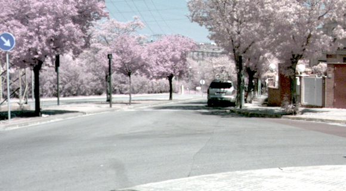

# rawImage_extractor 

## Bayer pattern = BGGR or BGNR, N=Near Infrared

rawImage_extractor is a matlab code for extracting image data from .raw  or .h5 image files. Such raw data are extracted without any image post processing  in 'open_raw.m' and 'h5_reader.h5. However, just for visualization porpose, the function 
'visualization_mat.m' will provide you some basic post-processing methods, moreover, we can find a good help [here](https://stackoverflow.com/questions/39623001/how-can-i-read-10-bit-raw-image-which-contain-rgb-ir-data).
To use the code, we have two raw and h5 images in 'dataset' folder:

	dataset/
		TE3-RGB-14_22-383.raw  <- rgb image
		TE3-RGBN-14_22-383.raw  <- the same scenario as before but with nir infection in the RGB channels
		RGBNC_296.h5
		RGBR_296.h5 (those h5 data are registered)

## Visualization
### RGB

### RGB+NIR

### NIR

The entire dataset will be found in [updated OMSIV](https://xavysp.github.io/ssmid-dataset/)
	

